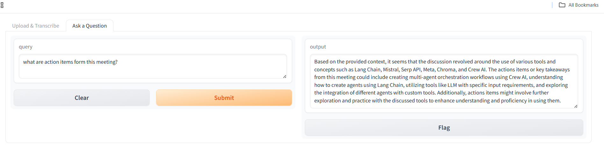
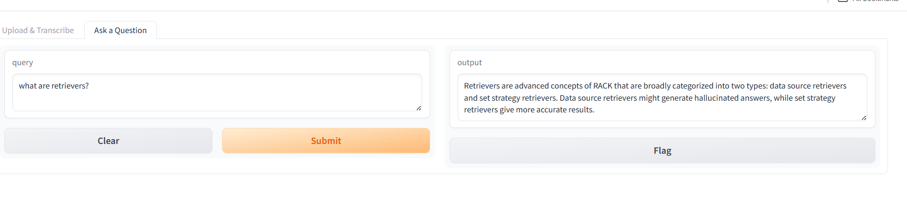

'''
# 🧠 Zoom Transcriber RAG Assistant


A smart assistant that lets you **upload Zoom meeting recordings**, **transcribe audio**, and **ask questions about the meeting** — all powered by **Faster Whisper**, **LangChain RAG**, **CHROMA**, and **OpenAI**. Built with ❤️ using Python, Gradio, and vector search.

---

## 🎯 Features

✅ Upload Zoom meeting recordings (MP4 or audio)  
✅ Transcribes using **faster-whisper** (Windows compatible)  
✅ Converts transcript into vector embeddings using **OpenAI**  
✅ Stores vectors in **CHROMA**  
✅ Ask questions about the meeting — get smart answers using **RAG (Retrieval-Augmented Generation)**  
✅ Simple **Gradio UI**

---

## 🚀 Quick Start

1. **Clone the Repo**
   ```bash
   git clone https://github.com/NANDINIGC22/zoom-transcriber-rag.git
   cd zoom-transcriber-rag
Set up environment

bash
Copy
Edit
python -m venv venv
venv\Scripts\activate  # On macOS/Linux use: source venv/bin/activate
pip install -r requirements.txt
Add .env file
Create a .env file in the root and paste:

ini
Copy
Edit
OPENAI_API_KEY=your_openai_api_key_here
Run the App

bash
Copy
Edit
python zoom_rag.py
## 🖼️ Screenshots

### 🟢 Upload Interface


### 💬 Chat Interface


### 📋 Summary View


🔼 Upload Meeting Recording

💬 Ask Questions About Meeting

🔍 How it Works
📥 You upload a recording

🗣️ It's transcribed using faster-whisper

🧠 The transcript is chunked and embedded using OpenAIEmbeddings

📚 Vectors are stored in a local CHROMA vector store

❓ Your question is converted to a vector and RAG finds the most relevant context

🤖 A final answer is generated using an LLM

Search Type Used:

python
Copy
Edit
vectordb.as_retriever(search_type="similarity", k=5)
It uses similarity search to retrieve the top 5 transcript chunks relevant to your question.

📁 Folder Structure
bash
Copy
Edit
zoom-transcriber-rag/
├── zoom_rag.py              # Main app code (Gradio, RAG)
├── requirements.txt         # All Python dependencies
├── .env                     # API keys (not pushed to GitHub)
├── assets/                  # Screenshots
└── README.md                # This file
🛠️ Built With
Faster Whisper – Fast Whisper ASR

OpenAI API – for Embeddings & Completion

LangChain – for RAG pipeline

CHROMA – Vector store

Gradio – UI

🙌 Credits
Created by Nandini GC

'''